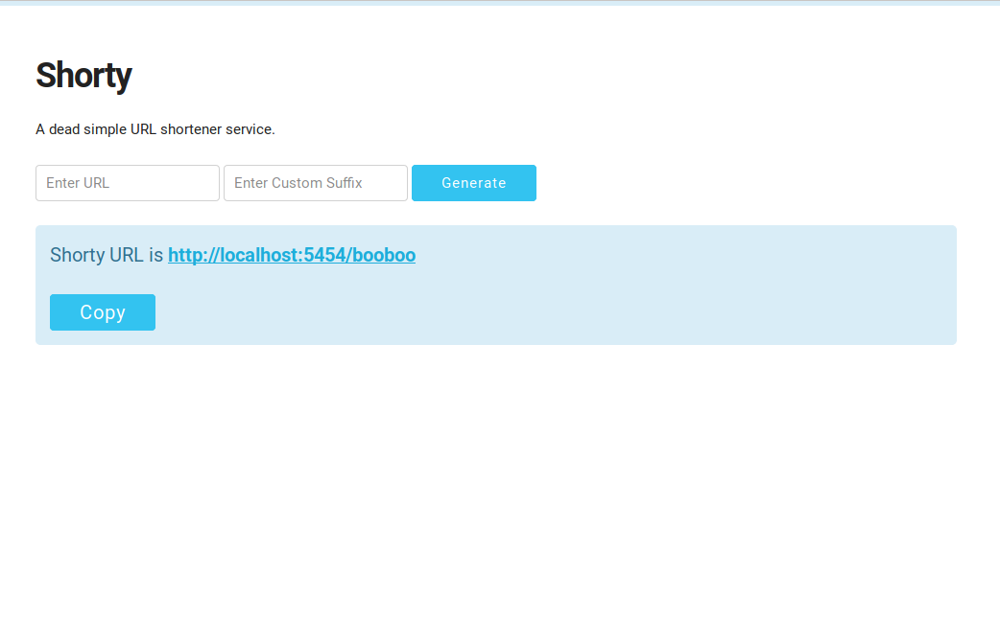

# Shorty

> A URL shortening service built using Flask & SQLite. 


## Getting Started

Clone or download this repository on your local machine 

```
git clone https://github.com/PadamSethia/shorty.git

cd shorty/

python ./app.py
```

### Prerequisites

This project requires Flask and SQLite . You can install it using the following commands . 
>You might need to sudo install it.

```
pip install flask

pip install sqlite3

pip install auth
```


## Authors

* **[Padam Sethia](https://github.com/PadamSethia)**
## License

This project is licensed under the MIT License - see the [LICENSE.md](LICENSE.md) file for details
