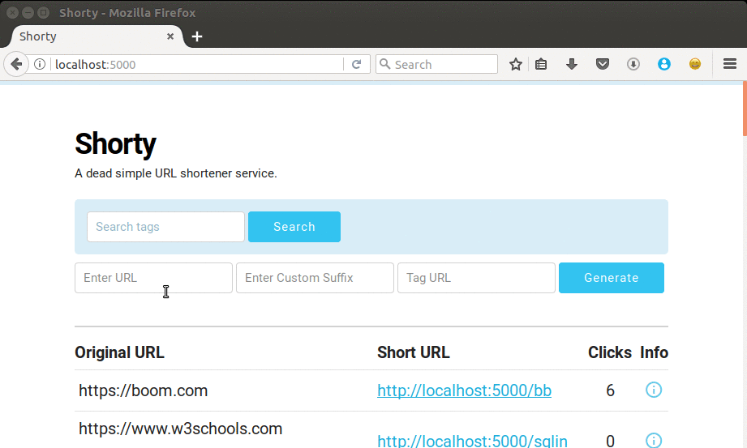

# Shorty

> A URL shortening service built using Flask & Mysql. 


## Getting Started

Clone or download this repository.

```
git clone https://github.com/PadamSethia/shorty.git

cd shorty/

python ./app.py
```

## Prerequisites

This project requires Flask and MySQL . 
And MySQLdb python module for connection.
You can install it using the following commands . 

```
pip install flask

```
For mysql as backend

```
sudo apt install mysql-server

sudo apt-get install libmysqlclient-dev

pip install MySQL-python
```
Now run the following command to create the MySQL table 

```
python ./create_table.py
```
Configure the MySQL database credentials in ```config.py```
Set the host , user , password and database name for MySQL connection.

Also under MySQL shell set 
```
set autocommit = 0
```
This takes care of the concurrency issue.

## RESTful API


`POST /api/v1/shorten` with form data `url=https://github.com/PadamSethia` , `custom=blah` & `tag=test` custom and tag are optional.


```json{
    "custom": "blah",
    "long_url": "https://github.com/PadamSethia",
    "short_url": "http://localhost:5454/blah",
    "tag": "test" 
}```


`GET /api/v1/expand/` with query `custom=blah`


```json{
    "click_browser": {
        "CHROME": 0,
        "FIREFOX": 0,
        "OTHER_BROWSER": 0,
        "SAFARI": 0
    },
    "click_platform": {
        "ANDROID": 0,
        "IOS": 0,
        "LINUX": 0,
        "MAC": 0,
        "OTHER_PLATFORM": 0,
        "WINDOWS": 0
    },
    "clicks": 0,
    "custom": "blah",
    "long_url": "http://github.com/PadamSethia",
    "tag" : "test"
}```


for now the web app and api run on different ports.
app : 5000 , api : 5454 

## Projects Used
* [Skeleton CSS Framework](http://getskeleton.com)
* [Clipboard.js](https://clipboardjs.com)

## License
This project is licensed under the MIT Licene.
