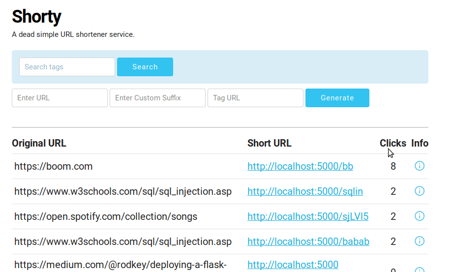

#  :link: Shorty

> A URL shortening service built using Flask & Mysql. 


## :tada: Surprise : Click Analytics 

Tracking for Operating system and platform used to access the link is available.




## Getting Started

Clone or download this repository.

```
git clone https://github.com/PadamSethia/shorty.git

cd shorty/

python ./app.py
```

## Prerequisites

This project requires Flask and MySQL . 
And MySQLdb python module for connection.
You can install it using the following commands . 

```
pip install flask

```
For mysql as backend

```
sudo apt install mysql-server

sudo apt-get install libmysqlclient-dev

pip install MySQL-python
```

Now run the following command to create the MySQL table 

```
python ./create_table.py
```

Configure the MySQL database credentials in `config.py`
Set the host , user , password and database name for MySQL connection.

Also under MySQL shell set 

```
set autocommit = 0
```

This takes care of the concurrency issue.

## RESTful API


`POST /api/v1/shorten` with form data `url=https://github.com/PadamSethia` , `custom=blah` & `tag=test` custom and tag are optional.


```json
{
    "custom": "blah",
    "long_url": "https://github.com/PadamSethia",
    "short_url": "http://localhost:5454/blah",
    "tag": "test" 
}
```


`GET /api/v1/expand/` with form data `custom=blah`


```json
{
    "click_browser": {
        "CHROME": 0,
        "FIREFOX": 0,
        "OTHER_BROWSER": 0,
        "SAFARI": 0
    },
    "click_platform": {
        "ANDROID": 0,
        "IOS": 0,
        "LINUX": 0,
        "MAC": 0,
        "OTHER_PLATFORM": 0,
        "WINDOWS": 0
    },
    "clicks": 0,
    "custom": "blah",
    "long_url": "http://github.com/PadamSethia",
    "tag" : "test"
}
```


>for now the web app and api run on different ports.
>app : 5000 , api : 8000

## Running for production

This section outlines how to setup and run shorty on web servers.
In this case I'll consider AWS EC2 instance.

* Set up the EC2 instance.

... [Learn more](http://bathompso.com/blog/Flask-AWS-Setup/)

* Clone this git repository.

Change the Host in `app.run()` to `0.0.0.0` , for both `shorty_api.py` and `app.py`

Now if you run `python ./app.py` , shorty should run under the server IP as `<server host>:<port>`
By default the `port` is `5000` , make sure to open the port before running the app.

### Creating Script for running the app

The inbuilt flask server is not built for production , it might do down after a couple of days .
So we need to use production ready web servers , for this we'll use uWSGI and Nginx.

First install uwsgi and nginx on EC2 instance

`pip install uwsgi`

If it doesn't work install from distro repo

**For Ubuntu**
`sudo apt-get install uwsgi-core uwsgi-plugin-python & nginx`


**For CentOS / Amazon Linux**
`sudo yum install uwsgi & nginx`


#### Using uWSGI to run app.py and shorty_api.py

The uwsgi file is already setup in this repo , just change the <user> to your user name .
For eg , 


`wsgi-file = /home/<user>/shorty/app.py`

Just change the `<user>` to your sepecified user name , for me it would be

`wsgi-file = /home/padam/shorty/app.py`

So update the `uwsgi_app` and `uwsgi_api` files.

Now to run the script , run 

`uwsgi --ini uwsgi_app &`

The `&` is used to run app.py in background.

For the API run

`uwsgi --ini uwsgi_api &`

Both the processes will run in background .


## Projects Used
* [Skeleton CSS Framework](http://getskeleton.com)
* [Clipboard.js](https://clipboardjs.com)

## License
This project is licensed under the MIT Licene.
